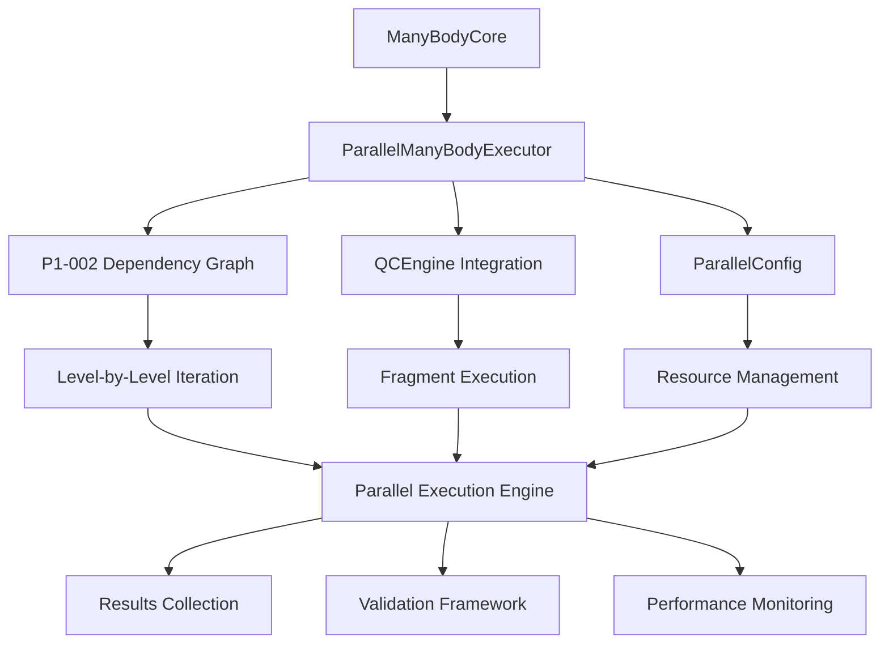

# Implementation Details

This document provides detailed technical information about the implementation of the QCManyBody Parallel Execution system.

## 🏗️ System Architecture

### Component Overview



### Key Design Decisions

#### 1. Level-by-Level Parallelization Strategy

**Problem**: Many-body calculations have strict mathematical dependencies where higher N-body terms depend on lower N-body results.

**Solution**: Implement level-by-level parallelization that respects dependencies:

```python
# Sequential between levels, parallel within levels
for level in [1, 2, 3, ...]:  # Sequential
    fragments_at_level = get_fragments_for_level(level)
    parallel_execute(fragments_at_level)  # Parallel
```

**Benefits**:
- Preserves mathematical correctness
- Enables parallelization where possible
- Maintains deterministic results

#### 2. P1-002 Dependency Graph Foundation

**Implementation**: Built on robust dependency graph system:

```python
class NBodyDependencyGraph:
    def iterate_molecules_by_level(self) -> Iterator[Tuple[int, List[FragmentDependency]]]:
        """Provides level-ordered iteration with performance optimization."""
        level_groups = defaultdict(list)

        for fragment_dep in self.fragment_dependencies:
            level = fragment_dep.nbody_level
            level_groups[level].append(fragment_dep)

        # Return in dependency order (1, 2, 3, ...)
        for level in sorted(level_groups.keys()):
            yield level, level_groups[level]
```

**Optimization Features**:
- Cached property evaluation
- Memory-efficient storage with `__slots__`
- Pre-computed dependency relationships
- Optimized iteration patterns

#### 3. Multi-Mode Execution Framework

**Implementation**: Flexible execution strategy selection:

```python
def execute_level_parallel(self, level: int, fragments: List) -> Dict:
    if self.config.execution_mode == "serial":
        # Sequential execution for debugging
        for fragment_spec in fragments:
            result = self.execute_fragment(fragment_spec)

    elif self.config.execution_mode == "threading":
        # Thread-based parallelism (good for I/O-bound QC)
        with ThreadPoolExecutor(max_workers=self.config.max_workers) as executor:
            futures = [executor.submit(self.execute_fragment, fs) for fs in fragments]

    elif self.config.execution_mode == "multiprocessing":
        # Process-based parallelism (CPU-intensive)
        with ProcessPoolExecutor(max_workers=self.config.max_workers) as executor:
            futures = [executor.submit(self.execute_fragment, fs) for fs in fragments]
```

**Mode Selection Guidelines**:
- **Serial**: Debugging, validation, single-core systems
- **Threading**: QCEngine integration (I/O-bound operations)
- **Multiprocessing**: Pure computational tasks (CPU-bound)

## 🔧 Core Implementation Components

### 1. ParallelManyBodyExecutor Class

#### Initialization and Validation

```python
def __init__(self, core: ManyBodyCore, config: ParallelConfig):
    self.core = core
    self.config = config
    self._dependency_graph = core.dependency_graph

    # Validation: ensure P1-002 foundation is available
    if not hasattr(core, 'iterate_molecules_by_level'):
        raise RuntimeError(
            "ManyBodyCore missing iterate_molecules_by_level() method. "
            "P1-002 dependency graph foundation required."
        )

    # Initialize execution statistics tracking
    self.execution_stats = {
        "total_fragments": 0,
        "levels_executed": 0,
        "parallel_time": 0.0,
        "sequential_time_estimate": 0.0,
        "speedup_factor": 0.0
    }
```

#### Main Execution Logic

```python
def execute_full_calculation(self) -> Dict[str, AtomicResult]:
    all_results = {}
    current_level = None
    fragments_at_current_level = []

    # Use P1-002 iterate_molecules_by_level() for dependency-aware execution
    for level, model_chemistry, label, molecule in self.core.iterate_molecules_by_level():

        # Check if we've moved to a new level
        if current_level is not None and level != current_level:
            # Execute all fragments at the previous level in parallel
            level_results = self.execute_level_parallel(current_level, fragments_at_current_level)
            all_results.update(level_results)

            # Reset for new level
            fragments_at_current_level = []
            self.execution_stats["levels_executed"] += 1

        # Add fragment to current level
        current_level = level
        fragments_at_current_level.append((level, model_chemistry, label, molecule))

    # Execute the final level
    if fragments_at_current_level:
        level_results = self.execute_level_parallel(current_level, fragments_at_current_level)
        all_results.update(level_results)
        self.execution_stats["levels_executed"] += 1

    return all_results
```

### 2. Fragment Execution Engine

#### QCEngine Integration

```python
def execute_fragment(self, fragment_spec: Tuple[int, str, str, Molecule]) -> Tuple[str, AtomicResult]:
    level, model_chemistry, label, molecule = fragment_spec

    if self.config.use_qcengine and HAS_QCENGINE:
        # Real QCEngine execution
        atomic_input = AtomicInput(
            molecule=molecule,
            driver="energy",
            model={
                "method": model_chemistry.lower(),
                "basis": self.config.basis_set
            },
            keywords=self.config.qcengine_config.get("keywords", {}),
            protocols=self.config.qcengine_config.get("protocols", {})
        )

        # Configure QCEngine task
        task_config = {
            "memory": self.config.memory_limit_mb,
            "ncores": 1,  # One core per fragment for parallel safety
            **self.config.qcengine_config.get("task_config", {})
        }

        # Execute with error handling
        result = qcng.compute(
            atomic_input,
            self.config.qc_program,
            raise_error=True,
            task_config=task_config
        )

        if not result.success:
            raise RuntimeError(f"QCEngine calculation failed: {result.error}")

    else:
        # Placeholder execution for testing/validation
        natoms = len(molecule.symbols)
        energy_estimate = -natoms * 1.0 - sum(ord(c) for c in label) * 1e-6

        result = AtomicResult(
            driver="energy",
            model={"method": model_chemistry, "basis": self.config.basis_set},
            molecule=molecule,
            return_result=energy_estimate,
            success=True,
            properties={},
            provenance={"creator": "qcmanybody-parallel", "version": "dev"}
        )

    return label, result
```

#### Error Handling and Recovery

```python
def execute_level_parallel(self, level: int, fragments_at_level: List) -> Dict:
    level_results = {}

    # Select execution strategy
    if self.config.execution_mode == "threading":
        with ThreadPoolExecutor(max_workers=self.config.max_workers) as executor:
            future_to_label = {
                executor.submit(self.execute_fragment, fragment_spec): fragment_spec[2]
                for fragment_spec in fragments_at_level
            }

            for future in as_completed(future_to_label, timeout=self.config.timeout_seconds):
                label = future_to_label[future]
                try:
                    result_label, result = future.result()
                    level_results[result_label] = result
                except Exception as e:
                    logger.error(f"Fragment {label} failed: {e}")
                    raise RuntimeError(f"Parallel execution failed for fragment {label}: {e}")

    return level_results
```

### 3. Performance Monitoring System

#### Execution Statistics Tracking

```python
def update_execution_statistics(self, level_execution_time: float, fragment_count: int):
    """Update performance statistics during execution."""
    self.execution_stats["total_fragments"] += fragment_count
    self.execution_stats["parallel_time"] += level_execution_time

    # Estimate sequential time (rough approximation)
    avg_fragment_time = level_execution_time / max(fragment_count, 1)
    self.execution_stats["sequential_time_estimate"] += avg_fragment_time * fragment_count

    # Calculate speedup factor
    if self.execution_stats["parallel_time"] > 0:
        self.execution_stats["speedup_factor"] = (
            self.execution_stats["sequential_time_estimate"] /
            self.execution_stats["parallel_time"]
        )
```

#### Memory and Resource Monitoring

```python
def monitor_resource_usage(self):
    """Monitor memory and CPU usage during execution."""
    import psutil

    process = psutil.Process()
    memory_usage = process.memory_info().rss / 1024 / 1024  # MB
    cpu_percent = process.cpu_percent()

    self.execution_stats.update({
        "memory_usage_mb": memory_usage,
        "cpu_percent": cpu_percent,
        "workers_active": self.config.max_workers
    })
```

## 🧪 Validation and Correctness Framework

### Ultra-Strict Validation

#### Mathematical Correctness Verification

```python
def validate_parallel_correctness(self, parallel_results: Dict, sequential_results: Dict,
                                tolerance: float = 1e-12) -> bool:
    """Ultra-strict validation with quantum chemistry precision."""

    # Check structural consistency
    if len(parallel_results) != len(sequential_results):
        raise ValueError(f"Result count mismatch")

    if set(parallel_results.keys()) != set(sequential_results.keys()):
        raise ValueError(f"Fragment label mismatch")

    # Numerical validation with ultra-strict tolerance
    max_difference = 0.0
    for label in parallel_results:
        parallel_energy = parallel_results[label].return_result
        sequential_energy = sequential_results[label].return_result

        difference = abs(parallel_energy - sequential_energy)
        max_difference = max(max_difference, difference)

        if difference > tolerance:
            raise ValueError(
                f"Energy difference for {label} exceeds tolerance: {difference} > {tolerance}"
            )

    logger.info(f"Validation passed: max difference = {max_difference:.2e}")
    return True
```

#### Fragment Preservation Verification

```python
def validate_fragment_preservation(self, original_fragments: Set, executed_fragments: Set) -> bool:
    """Ensure all original fragments are executed exactly once."""

    if original_fragments != executed_fragments:
        missing = original_fragments - executed_fragments
        extra = executed_fragments - original_fragments

        raise ValueError(
            f"Fragment preservation failed: missing={missing}, extra={extra}"
        )

    return True
```

### Dependency Ordering Verification

```python
def validate_dependency_ordering(self, execution_order: List[Tuple[int, str]]) -> bool:
    """Verify that execution respects N-body dependencies."""

    previous_level = 0
    for level, label in execution_order:
        if level < previous_level:
            raise ValueError(
                f"Dependency violation: level {level} executed after level {previous_level}"
            )
        previous_level = level

    # Verify level progression is contiguous
    levels_seen = sorted(set(level for level, _ in execution_order))
    expected_levels = list(range(1, max(levels_seen) + 1))

    if levels_seen != expected_levels:
        raise ValueError(
            f"Non-contiguous level execution: {levels_seen} != {expected_levels}"
        )

    return True
```

## 🚀 Performance Optimization Strategies

### 1. Memory Optimization

#### Efficient Fragment Storage

```python
class FragmentDependency:
    """Optimized fragment representation with minimal memory footprint."""

    __slots__ = ('mc', 'label', 'mol', '_real_atoms', '_basis_atoms', '_nbody_level')

    def __init__(self, mc: str, label: str, mol: Molecule):
        self.mc = mc
        self.label = label
        self.mol = mol

        # Use cached properties for performance
        self._real_atoms = None
        self._basis_atoms = None
        self._nbody_level = None
```

#### Cached Property Evaluation

```python
@property
def nbody_level(self) -> int:
    """Cached N-body level calculation."""
    if self._nbody_level is None:
        self._parse_label()
    return self._nbody_level

@property
def real_atoms(self) -> List[int]:
    """Cached real atoms list."""
    if self._real_atoms is None:
        self._parse_label()
    return self._real_atoms
```

### 2. Execution Optimization

#### Pre-computation and Caching

```python
def __init__(self, core: ManyBodyCore, config: ParallelConfig):
    # Pre-compute common values outside execution loops
    self.has_embedding = bool(core.embedding_charges)
    self.base_molecular_updates = {"fix_com": True, "fix_orientation": True}

    # Cache dependency graph for efficient access
    self._dependency_graph = core.dependency_graph
```

#### Efficient Iteration Patterns

```python
def iterate_molecules_by_level(self) -> Iterator[Tuple[int, List[FragmentDependency]]]:
    """Optimized level-by-level iteration with minimal overhead."""

    # Group fragments by level with single pass
    level_groups = defaultdict(list)
    for fragment_dep in self.fragment_dependencies:
        level = fragment_dep.nbody_level  # Cached property
        level_groups[level].append(fragment_dep)

    # Yield in dependency order
    for level in sorted(level_groups.keys()):
        yield level, level_groups[level]
```

### 3. Parallel Execution Optimization

#### Worker Pool Management

```python
def execute_level_parallel(self, level: int, fragments_at_level: List) -> Dict:
    """Optimized parallel execution with efficient resource management."""

    if not fragments_at_level:
        return {}

    # Select optimal execution strategy
    if len(fragments_at_level) == 1:
        # Single fragment: execute directly (avoid pool overhead)
        label, result = self.execute_fragment(fragments_at_level[0])
        return {label: result}

    # Multiple fragments: use appropriate parallel execution
    if self.config.execution_mode == "threading":
        # Threading with context manager for automatic cleanup
        with ThreadPoolExecutor(max_workers=min(len(fragments_at_level), self.config.max_workers)) as executor:
            # Submit all tasks
            future_to_label = {
                executor.submit(self.execute_fragment, fragment_spec): fragment_spec[2]
                for fragment_spec in fragments_at_level
            }

            # Collect results with timeout handling
            level_results = {}
            for future in as_completed(future_to_label, timeout=self.config.timeout_seconds):
                label = future_to_label[future]
                result_label, result = future.result()
                level_results[result_label] = result

    return level_results
```

#### Memory-Aware Scheduling

```python
def calculate_optimal_worker_count(self, fragments: List, available_memory: int) -> int:
    """Calculate optimal worker count based on memory constraints."""

    # Estimate memory per fragment
    avg_fragment_size = sum(len(f[3].symbols) for f in fragments) / len(fragments)
    estimated_memory_per_fragment = avg_fragment_size * 50  # MB estimate

    # Calculate maximum workers based on memory
    max_workers_by_memory = available_memory // estimated_memory_per_fragment

    # Return minimum of configured and memory-constrained workers
    return min(self.config.max_workers, max_workers_by_memory, len(fragments))
```

## 🔍 Testing and Quality Assurance Implementation

### Comprehensive Test Framework

#### Test Configuration Generation

```python
def create_test_configurations(self) -> List[Dict]:
    """Generate comprehensive test matrix."""

    test_configs = []

    # Test different molecular systems
    systems = ["simple_dimer", "water_dimer", "water_trimer"]

    # Test different execution modes
    execution_modes = ["serial", "threading"]

    # Test different worker counts
    worker_counts = [1, 2, 4]

    # Test different BSSE treatments
    bsse_types = [[BsseEnum.nocp], [BsseEnum.cp]]

    for system in systems:
        for bsse_type in bsse_types:
            for mode in execution_modes:
                for workers in worker_counts:
                    if mode == "serial" and workers > 1:
                        continue  # Skip invalid combinations

                    test_configs.append({
                        "system": system,
                        "bsse_type": bsse_type,
                        "execution_mode": mode,
                        "max_workers": workers,
                        "test_id": f"{system}_{bsse_type[0].value}_{mode}_{workers}w"
                    })

    return test_configs
```

#### Automated Validation Pipeline

```python
def run_comprehensive_validation(self) -> bool:
    """Run complete validation suite with ultra-strict tolerance."""

    test_configs = self.create_test_configurations()
    all_passed = True

    for config in test_configs:
        try:
            # Create test system
            molecule = self.create_test_molecule(config["system"])
            core = self.create_manybody_core(molecule, config["bsse_type"])

            # Run reference sequential calculation
            reference_results = self.run_sequential_reference(core)

            # Run parallel test
            parallel_config = ParallelConfig(
                execution_mode=config["execution_mode"],
                max_workers=config["max_workers"],
                use_qcengine=False  # Consistent placeholder for validation
            )

            parallel_results = self.run_parallel_test(core, parallel_config)

            # Validate with ultra-strict tolerance
            test_passed = self.validate_results(reference_results, parallel_results,
                                             config["test_id"], tolerance=1e-12)

            if not test_passed:
                all_passed = False

        except Exception as e:
            logger.error(f"{config['test_id']}: EXCEPTION - {e}")
            all_passed = False

    return all_passed
```

---

This implementation provides a robust, high-performance parallel execution system that maintains the mathematical rigor required for quantum chemistry while enabling significant performance improvements through careful parallelization strategies.