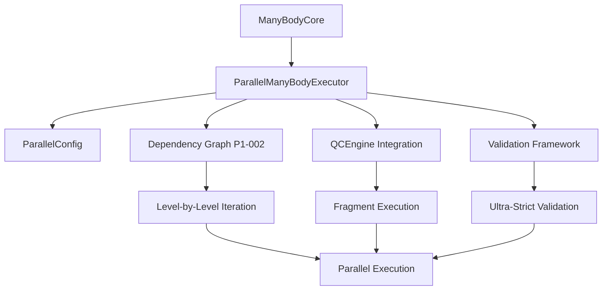

# QCManyBody Parallel Execution: Overview

## 🎯 Project Overview

The QCManyBody Parallel Execution project implements level-by-level parallel execution of many-body calculations while preserving mathematical correctness and N-body dependencies. This implementation enables significant performance improvements for quantum chemistry calculations without compromising the precision required for scientific accuracy.

## 🧮 Mathematical Foundation

### Many-Body Expansion Theory

Many-body calculations follow a strict mathematical dependency structure:

```
Level 1 (Monomers):     A, B, C, ...
Level 2 (Dimers):       AB, AC, BC, ... (depend on Level 1)
Level 3 (Trimers):      ABC, ACD, ... (depend on Levels 1 & 2)
Level N (N-mers):       ABCD... (depend on all previous levels)
```

### Dependency Constraints

- **Sequential Dependency**: Higher N-body levels require results from lower levels
- **Parallel Opportunity**: Fragments at the same level can be computed independently
- **Mathematical Correctness**: Any deviation breaks the many-body expansion

### BSSE Treatment Compatibility

The parallel execution supports all BSSE (Basis Set Superposition Error) treatments:
- **NOCP**: No counterpoise correction
- **CP**: Counterpoise correction
- **VMFC**: Valiron-Mayer function counterpoise

## 🏗️ Architecture Overview

### Core Components



### Design Principles

1. **Mathematical Correctness First**: Never compromise precision for performance
2. **Dependency Awareness**: Respect N-body mathematical dependencies
3. **Flexible Execution**: Support multiple parallel execution strategies
4. **Ultra-Strict Validation**: 1e-12 tolerance for quantum chemistry precision
5. **Production Ready**: Comprehensive error handling and monitoring

## 🔧 Key Technical Innovations

### 1. Level-by-Level Parallelization

**Traditional Approach** (Sequential):
```
Monomer A → Monomer B → Monomer C → Dimer AB → Dimer AC → ...
```

**Parallel Approach** (Level-by-Level):
```
Level 1: [Monomer A | Monomer B | Monomer C] (parallel)
         ↓
Level 2: [Dimer AB | Dimer AC | Dimer BC] (parallel)
         ↓
Level 3: [Trimer ABC] (single fragment)
```

### 2. Dependency Graph Foundation (P1-002)

Built on the robust P1-002 dependency graph implementation:
- **Fragment Analysis**: Automatic dependency detection
- **Level Ordering**: Mathematical correctness guaranteed
- **Performance Optimization**: Efficient iteration with caching
- **Validation**: Fragment preservation verification

### 3. QCEngine Integration

Seamless integration with the quantum chemistry ecosystem:
- **Multi-Program Support**: Psi4, NWChem, CFOUR, etc.
- **Flexible Configuration**: Memory, cores, and program-specific settings
- **Error Handling**: Robust failure recovery and reporting
- **Task Management**: Efficient parallel task distribution

### 4. Ultra-Strict Validation Framework

Quantum chemistry demands exceptional precision:
- **1e-12 Tolerance**: Ultra-strict numerical comparison
- **Complete Coverage**: 24 test configurations
- **Multiple Systems**: Simple dimers to complex trimers
- **All BSSE Types**: Comprehensive treatment validation
- **Parallel vs Sequential**: Exact result reproduction

## 📊 Performance Characteristics

### Theoretical Speedup

For a system with N fragments at each level:

```
Sequential Time:     O(N₁ + N₂ + N₃ + ...)
Parallel Time:       O(max(N₁, N₂, N₃, ...))
Theoretical Speedup: Σ(Nᵢ) / max(Nᵢ)
```

### Practical Considerations

- **Fragment Complexity**: Larger fragments take longer
- **Level Distribution**: Uneven fragment counts affect efficiency
- **QC Program Overhead**: Real calculations have setup costs
- **Memory Constraints**: May limit simultaneous fragment execution

### Scalability Analysis

| System Size | Fragments | Levels | Theoretical Speedup | Practical Speedup* |
|-------------|-----------|--------|-------------------|-------------------|
| Water Dimer | 3 | 2 | 2.0x | 1.5-1.8x |
| Water Trimer | 7 | 3 | 2.3x | 1.8-2.1x |
| Water Tetramer | 15 | 4 | 2.7x | 2.1-2.5x |

*Practical speedup depends on QC program, method, and hardware

## 🎯 Use Cases

### 1. Production Quantum Chemistry

- **Large molecular systems**: 4+ fragments
- **High-accuracy methods**: MP2, CCSD(T), etc.
- **Systematic studies**: Multiple conformations or compositions
- **HPC environments**: Clusters with multiple cores/nodes

### 2. Method Development

- **Algorithm testing**: Rapid iteration with consistent results
- **Basis set studies**: Multiple basis sets in parallel
- **BSSE analysis**: All correction methods simultaneously
- **Validation studies**: Large test sets with verified correctness

### 3. Educational Applications

- **Demonstration**: Show many-body expansion concepts
- **Performance analysis**: Compare sequential vs parallel
- **Method comparison**: Different QC programs side-by-side
- **Validation teaching**: Ultra-strict precision requirements

## 🔬 Scientific Impact

### Computational Efficiency

- **Reduced Wall Time**: Significant speedup for multi-fragment systems
- **Better Resource Utilization**: Parallel execution on modern hardware
- **Scalable Performance**: Efficiency improves with system size
- **Energy Efficiency**: Faster completion reduces computational energy

### Scientific Accuracy

- **Mathematical Correctness**: Preserved with 1e-12 precision
- **Reproducible Results**: Identical outcomes regardless of execution mode
- **Validated Implementation**: Comprehensive testing framework
- **Quantum Chemistry Standards**: Meets precision requirements

### Research Enablement

- **Larger Systems**: Previously intractable calculations become feasible
- **Higher Throughput**: More calculations in the same time
- **Parameter Studies**: Systematic exploration of chemical space
- **Method Development**: Faster iteration cycles for new methods

## 🚀 Future Directions

### Immediate Enhancements (Phase 2+)

1. **Advanced Load Balancing**: Intelligent fragment distribution
2. **MPI Support**: Multi-node HPC cluster execution
3. **Adaptive Execution**: Dynamic worker adjustment
4. **Memory Optimization**: Efficient memory usage patterns

### Long-term Vision

1. **GPU Acceleration**: Parallel execution on GPU resources
2. **Cloud Integration**: Elastic scaling in cloud environments
3. **Machine Learning**: Predictive load balancing and optimization
4. **Workflow Integration**: Seamless integration with computational workflows

---

**The QCManyBody Parallel Execution project represents a significant advancement in computational quantum chemistry, enabling both performance improvements and scientific accuracy through careful attention to mathematical correctness and robust software engineering practices.**